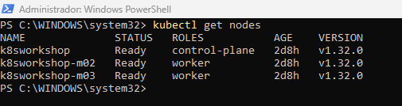
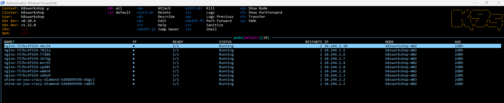
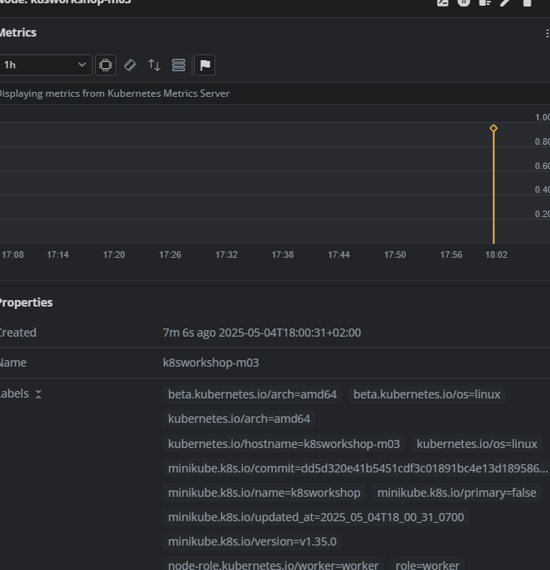

> minikube start

> minikube status

```
set NO_PROXY=localhost,127.0.0.1,10.96.0.0/12,192.168.59.0/24,192.168.49.0/24,192.168.39.0/24

minikube start --nodes 3 -p k8sworkshop --memory 4096 --driver=docker
```

let's relabel the nodes to workers so we can use the label as selector

kubectl get nodes



**Label Nodes**

Label the nodes m02 and m03 as worker

> kubectl label node <node_name> node-role.kubernetes.io/worker=worker

check if the nodes are correctly labeled

> kubectl get nodes

kubectl label nodes <node_name> role=worker

**Deploy Redis and  NGinx**

kubectl apply -f <yaml_file.yml>

check in k9s the status of your deployment



kubectl get pods -o wide





Clean Up

kubectl delete deployments <httpd_deployment_name> <redis_deployment_name>

kubectl delete nodes <node_name> <node_name> <node_name>

minikube -p k8sworkshop stop

minikube -p k8sworkshop delete
