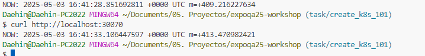
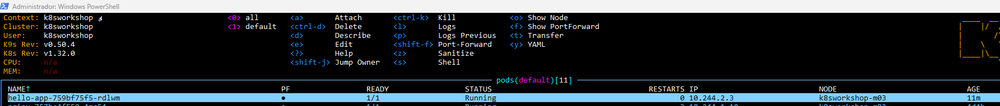
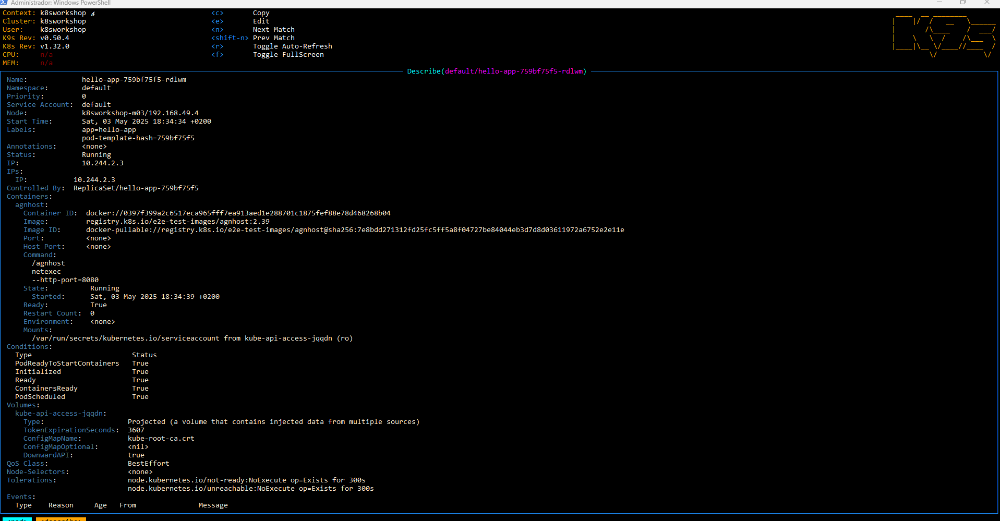

## Deploy an Application

kubectl create deployment hello-app --image=registry.k8s.io/e2e-test-images/agnhost:2.39 -- /agnhost netexec --http-port=8080

kubectl get deployments

kubectl get pods

kubectl get events

kubectl --help

## Connectivity to the Cluster

kubectl config current-context

kubectl config get-contexts

kubectl config view | grep minikube  // kubectl config view | findstr minikube

## Expose the Application

kubectl expose deployment hello-app --port=8080

kubectl get services

kubectl port-forward service/hello-app 30070:8080

Find a browser and go to [http://localhost:30070](http://localhost:30070/) and see the current time as the answer

What did we do

kubectl get namespaces

kubectl get ns default -o yaml

create a new namespace

kubectl create ns justforfun

kubectl get ns justforfun -o yaml

kubectl get all -n justforfun   <- it should be empty

kubectl get all -n default

kubectl get deployments hello-app  -o yaml

addressing the type and object

kubectl get deployment.apps/hello-app  -o yaml

same for the service

kubectl get service/hello-app  -o yaml

kubectl get pod/<pod_name> -o yaml

through k9s pressing d you can enter to the -o yaml ( describe ) of the pod

or through command line

kubectl get pods $(kubectl get pods -template '{{range .items}}{{.metadata.name}}{{"\n"}}{{end}}') -o yaml

checking the number of replicas in the deployment

kubectl get deployments

> $ kubectl get deployments
> NAME                         READY   UP-TO-DATE   AVAILABLE   AGE
> hello-app                    1/1     1            1           14m
> nginx                        8/8     8            8           4d4h
> shine-on-you-crazy-diamond   2/2     2            2           4d4h

kubectl get deployment.apps/<deployment_name> -o jsonpath='{.spec.replicas}'
