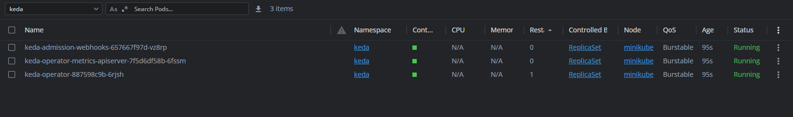

https://keda.sh/docs/2.17/scalers/prometheus/#examples

https://blog.cloudacode.com/how-to-autoscale-kubernetes-pods-based-on-ingress-request-prometheus-keda-and-k6-84ae4250a9f3

##### 

## Start Cluster

minikube start --driver=docker --extra-config=apiserver.enable-admission-plugins=NamespaceLifecycle,LimitRanger,ServiceAccount,DefaultStorageClass,DefaultTolerationSeconds,NodeRestriction,MutatingAdmissionWebhook,ValidatingAdmissionWebhook,ResourceQuota

## Install Keda

##### https://keda.sh/docs/latest/deploy/#helm

```console
kubectl create ns keda
```

```console
helm repo add kedacore https://kedacore.github.io/charts
helm repo update
helm upgrade --install keda kedacore/keda -n keda
```

##### check if keda is correctly deployed

```console
kubectl get pod -l app=keda-operator -n keda
```



```console
cd kubernetes101/keda/manifests/hello-world/
kubectl apply -k ./
```

Deploy the hello-world example manually

```console
# hello world namespaces
kubectl create ns hello-world
# hello world deployments
kubectl apply -f deployments -n hello-world
# hello world service
kubectl apply -f service -n hello-world
# hello world ingress depends on your ingress class such as gce, nginx
kubectl apply -f ingress/nginx -n hello-world
```


kubectl get ingress --all-namespaces

minikube ip e.g.  192.168.49.2

192.168.49.2  hello.p.cloudacode.com

then modify the hosts file adding the minikybe ip assigned to the domain

**The** **hosts file** **, which can be manually edited to block access to specific websites, is located in the following directories:**

**Windows 10 and 11** : "C:\Windows\system32\drivers\etc"

**Linux** : "/etc/hosts"

**Mac OS X** : "/private/etc/hosts"
