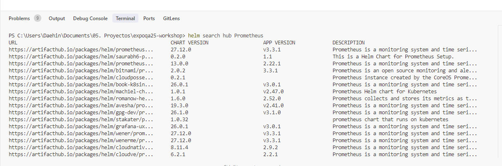
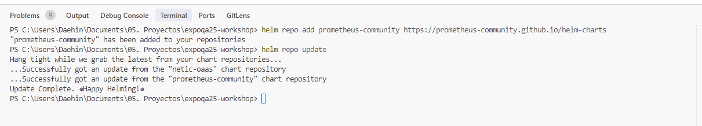
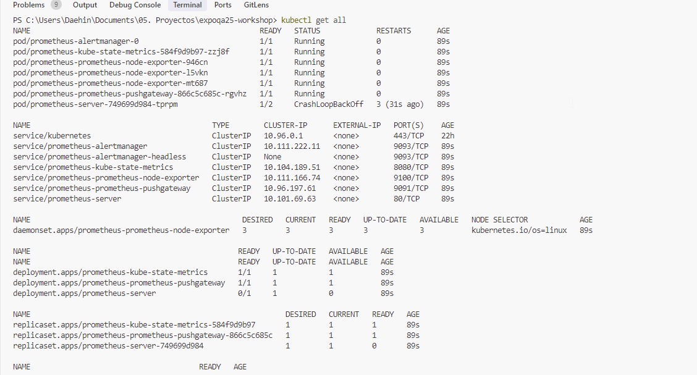

helm search hub Prometheus



```console
helm repo add prometheus-community https://prometheus-community.github.io/helm-charts
helm repo update
```



We have downloaded the last version of prometheus.

```console
helm install prometheus prometheus-community/prometheus
```

after installing prometheus we can run kubectl command



