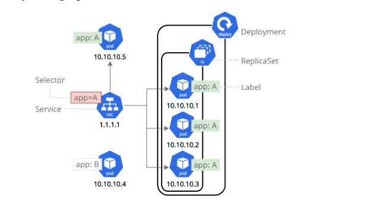

## Connectivity to the Cluster

We have used `kubectl` to retrieve information from the running cluster. It turns out that
`minikube` added entries into a default configuration for Kubernetes command line tooling such
that the tooling may connect to the cluster.

The `config` sub-command of `kubectl` can be used to view the configuration entries.
The configuration may contain a number of different contexts and the one we are currently using
can be found with:

```console
kubectl config current-context
```

Btw. what other contexts do we have?

```console
kubectl config get-contexts
```

Current context is normally in this workshop `minikube`.

```console
kubectl config view | grep minikube
```

If you happen to work on windows and did not install grep, you may use:

```console
kubectl config view | Findstr minikube
```

## Get nodes

```
kubectl get nodes --help
```

# Start working with kubernetes

There are two fundamental ways to work with kubernetes:

- the imperative way
- the declarative way

where the declarative way seems to be the way most people want to work with it in a real life scenario.

The following examples will show both ways of working. Lets see the differences between the two.

## Deploy an app imperative way

```
kubectl create deployment kubernetes-bootcamp --image=gcr.io/google-samples/kubernetes-bootcamp:v1
kubectl get deployments
```

So what happened:

```console
kubectl get events
```

To further explore what `kubectl` can do for you

```console
kubectl --help
```

### Open a second terminal to run the proxy

```
kubectl proxy
```

## curl to the deployed app

```
curl http://localhost:8001/version
```

## Show the app in the terminal

```
kubectl proxy
```

## get the Pod name and query that pod directly through the proxy

```
export POD_NAME="$(kubectl get pods -o go-template --template '{{range .items}}{{.metadata.name}}{{"\n"}}{{end}}')"
echo Name of the Pod: $POD_NAME
curl http://localhost:8001/api/v1/namespaces/default/pods/$POD_NAME/proxy/    # The URL is the route to the API of the Pod.
```

## View Container logs

```
kubectl logs "$POD_NAME"
```

## Executing command on the container

```
kubectl exec -ti $POD_NAME -- bash     # kubectl exec "$POD_NAME" -- env
cat server.js  # inside the pod
curl http://localhost:8080
```

## Create a new services

```
kubectl get pods
kubectl get services
kubectl expose deployment/kubernetes-bootcamp --type="NodePort" --port 8080
kubectl describe services/kubernetes-bootcamp
```

## Create an environment variable NODE_PORT

```
export NODE_PORT="$(kubectl get services/kubernetes-bootcamp -o go-template='{{(index .spec.ports 0).nodePort}}')"
echo "NODE_PORT=$NODE_PORT"
curl http://"$(minikube ip):$NODE_PORT"
```

## Using Labels

```
kubectl describe deployment
kubectl get pods -l app=kubernetes-bootcamp
kubectl get services -l app=kubernetes-bootcamp
```

## relabel

```
kubectl label pods "$POD_NAME" version=v1
```

## Delete services

```
kubectl delete service -l app=kubernetes-bootcamp  # to prove the app is still running in the container kubectl exec -ti $POD_NAME -- curl http://localhost:8080
```

## Scale your app

```
kubectl get deployments  # to get the name, status, availability and age of the deployment
kubectl get rs           # get replicaset  desired, current, ready, age
kubectl scale deployments/kubernetes-bootcamp --replicas=4
kubectl describe deployments/kubernetes-bootcamp
```

## Reconcillation Loop and desired state

Kubernetes attempts to maintain the desired state, which is what is defined for the cluster as the state it shouold be in.
As an example of that we just scaled the deployment to a replica size of 4, so what would happen is we deleted one of the replicas?

Lets look at the pods we have:

```console
kubectl get pods 
```

Lets try to delete one of the pods:

```console
kubectl delete pod kubernetes-bootcamp-xxxxxxxx-xxxxx 
```

You see that there are 4 pods running soon again, however the pod you just deleted is gone and replaced with a new one,
the result being that the desired state is obtained again.

```console
kubectl get pods 
```

This is what sometimes is referred to as "self-healing", and that increases the robustness for keeping stuff running.

## Load Balancing

```
kubectl describe services/kubernetes-bootcamp   # it doesnt' exist --> kubectl expose deployment/kubernetes-bootcamp --type="NodePort" --port 8080
export NODE_PORT="$(kubectl get services/kubernetes-bootcamp -o go-template='{{(index .spec.ports 0).nodePort}}')"
echo NODE_PORT=$NODE_PORT
curl http://"$(minikube ip):$NODE_PORT"      # we hit a different pod with every curl
```

## Scale Down

```
kubectl scale deployments/kubernetes-bootcamp --replicas=2
kubectl get deployments
kubectl get pods -o wide
```

## Rolling Update

```
kubectl get pods
kubectl describe pods
kubectl set image deployments/kubernetes-bootcamp kubernetes-bootcamp=jocatalin/kubernetes-bootcamp:v2 # update to version v2
kubectl get pods
```

## Verify Update

```
kubectl describe services/kubernetes-bootcamp
export NODE_PORT="$(kubectl get services/kubernetes-bootcamp -o go-template='{{(index .spec.ports 0).nodePort}}')"
echo "NODE_PORT=$NODE_PORT"
curl http://"$(minikube ip):$NODE_PORT"

kubectl rollout status deployments/kubernetes-bootcamp
```

## ROLLBACK

```
kubectl set image deployments/kubernetes-bootcamp kubernetes-bootcamp=gcr.io/google-samples/kubernetes-bootcamp:v10
kubectl get deployments
kubectl get pods

kubectl rollout undo deployments/kubernetes-bootcamp
```

## Clean your local Cluster

```
kubectl delete deployments/kubernetes-bootcamp services/kubernetes-bootcamp
```

## Namespace

This can be seen, if you make the following call:

```console
kubectl get namespaces
```

You see one of these namespaces is called "default", and if we do not specify anything concerning namespaces
(and we did not) then that is the default place to do stuff. This means that everything we did, went into that namespace.

We can use a short form for `namespaces` called `ns`

```console
kubectl get ns
```

There is a way to get the specification for the default namespace.

```console
kubectl get ns default -o yaml
```

which means we ask for the contents of the "namespace object" called "default" and requests to have the in the form of YAML.

The namespace object is one of the simplest objects in the kubernetes universe:

```yaml
apiVersion: v1
kind: Namespace
metadata:
  creationTimestamp: "2023-02-28T16:36:10Z"
  labels:
    kubernetes.io/metadata.name: default
  name: default
  resourceVersion: "192"
  uid: faeea1f1-aafd-4674-b894-5928c9543e83
spec:
  finalizers:
  - kubernetes
status:
  phase: Active
```

For the fun of it we could create another one:

```console
kubectl create ns justforfun
```

and see that it is in the list of namespaces:

```console
kubectl get ns
```

You should now see that there is a namespace in the list called "justforfun":

```console
kubectl get ns justforfun -o yaml
```

which means we ask for the contents of the "namespace object" called "justforfun" and requests to have the in the form of YAML

```yaml
apiVersion: v1
kind: Namespace
metadata:
  creationTimestamp: "2025-05-07T17:54:40Z"
  labels:
    kubernetes.io/metadata.name: justforfun
  name: justforfun
  resourceVersion: "34093"
  uid: d4eb3c63-f8d7-4a59-9a38-d07fd23aa023
spec:
  finalizers:
  - kubernetes
status:
  phase: Active
```

There is nothing deployed into this namespace and thus it should be empty:

```console
kubectl get all -n justforfun 
```

If you want to see the contents of the namespace, you may use:

```console
kubectl get pods $(kubectl get pods --template '{{range .items}}{{.metadata.name}}{{"\n"}}{{end}}') -o yaml --all-namespaces
```

If you remember the output from the Deployment object, you may recall that there was a line stating something about replicas:

```console
kubectl get deployment.apps/kubernetes-bootcamp -o jsonpath='{.spec.replicas}'
```

And that was default set to 1. This means that the application is supposed to have only one running pod. This can be seen by:

```console
kubectl get pods
```

You can see one pod prefixed with `kubernetes-bootcamp` and that 1 of 1 container is READY, let us try to look at the the actual object
handling the replicas for the deployment:

```console
 kubectl get rs
```

## Other useful commands and reference

Getting the logs from a given pod

```console
kubectl logs pod/hello-app-xxyyynnncd-brre2nn
```

In the event that the pods has muliple running containers - you can specify the individuual container:

```console
kubectl logs pod/hello-app-xxyyynnncd-brre2nn -c agnhost
```

Or if you want to have logs based on an assigned label:

```console
kubectl logs -l app=hello-app 
```

There are plenty of commands that you can use for all sorts of things, please consult the
[kubectl cheatsheet](https://kubernetes.io/docs/reference/kubectl/cheatsheet/)

# The declarative way

The declarative way is, as mentioned earlier, when the objects used in kubernetes are specified (or declared) in files. In this section we
will use kubectl to "push" these definitions to Kubernetes. As such this may not seem (in this context) to be a major gamechanger, however
in a real-life scenario this allows you to have the declarations separated from the commands that make the cluster aware of the
configurations it needs to deal with, and have them under version control.
Having these declarations under version control gives you the ability to treat configurations as source code and thus use the same paradigms
for the infrastructure as for the code. This is among other things: full versioning, auditability, merge and conflict resolving,
build and test of configurations.
You can even use daemons inside the cluster to fetch changes from the version control system and "pull" that into the cluster,
thus avoiding distribution of credentials with the ability to change things in the cluster instead protecting these inside the cluster.
However this is a complete topic on its own - for another day - perhaps.

In this workshop, we will work with the declarative parts and just use kubectl to push the declarations to the cluster. We will be
using quite a lot of the same checking commands as you have already seen above. One big difference is that we are going to
deploy into a target namespace called "hello-workshop"

Lets start creating the namespace, but before that let us take a look at a very simple namespace definition:

```console
cat namespace.yaml 
```

If you do not find the file, please switch to the `simple-kubernetes`folder.

Which will look like this:

```yaml
apiVersion: v1
kind: Namespace
metadata:
  name: hello-workshop
```

Let us create that in the cluster:

```console
kubectl create -f ./namespace.yaml
```

Lets list the namespaces:

```console
kubectl get ns
```

That may include the previously created namespace "justforfun" and then it would look like:

```console
NAME              STATUS   AGE
default           Active   6h34m
hello-workshop    Active   26m
ingress-nginx     Active   6h19m
justforfun        Active   9m45s
keda              Active   6h33m
kube-node-lease   Active   6h34m
kube-public       Active   6h34m
kube-system       Active   6h34m
```

If we would delete the namespace we just created, that could be done like this in the declarative way ***However - do not delete it as we shall be using it later***:

```console
kubectl delete -f ./namespace.yaml
```

If we want to do the same for the "justforfun" this can be done in a imperative way like:

```console
kubectl delete ns justforfun
```

The resulting list would be:

```console
NAME              STATUS   AGE
default           Active   6h35m
hello-workshop    Active   26m
ingress-nginx     Active   6h20m
keda              Active   6h34m
kube-node-lease   Active   6h35m
kube-public       Active   6h35m
kube-system       Active   6h35m
```

Now we can create the same deployment as before by applying the deployment from `deployment.yaml`. Note that
the namespace is already part of the specification in `deployment.yaml` and therefore the deployment ends up
in the `hello-workshop` namespace. You can see that if you list the yaml file that contains the information for the deployment.

```console
cat ./deployment.yaml
```

```yaml
apiVersion: apps/v1
kind: Deployment
metadata:
  labels:
    app: hello-app
  name: hello-app
  namespace: hello-workshop
spec:
  replicas: 1
  selector:
    matchLabels:
      app: hello-app
  template:
    metadata:
      creationTimestamp: null
      labels:
        app: hello-app
    spec:
      containers:
      - command:
        - /agnhost
        - netexec
        - --http-port=8080
        image: registry.k8s.io/e2e-test-images/agnhost:2.39
        name: agnhost
```

If you look carefully, you can see the `hello-app` metadata namespace that it is targeted for the `hello-workshop`

```console
kubectl create -f ./deployment.yaml
```

Try to do overwrite the namespace by supplying to the command line, e.g.:

```console
kubectl create -f ./deployment.yaml -n hello-workshop-non-existing-namespace
```

That will fail, however had it been a valid namespace it would have been deployed there as well.

Lets look at what has been deployed in the "hello-workshop" namespace.

```console
kubectl get all -n hello-workshop
```

This looks very much like what we saw under the imperative paradigm for the "default" namespace above after deploying the `hello-app`.

```console
NAME                                  READY      STATUS       RESTARTS    AGE
pod/hello-app-57d9ccdbbc-vw2nn        1/1        Running      0           1m18s

NAME                                  READY      UP-TO-DATE   AVAILABLE   AGE
deployment.apps/hello-app             1/1        1            1           1m18s

NAME                                   DESIRED   CURRENT      READY       AGE
replicaset.apps/hello-app-57d9ccdbbc   1         1            1           1m18s
```

So what did we deploy:

```console
cat deployment.yaml
```

Which looks like this:

```yaml
apiVersion: apps/v1
kind: Deployment
metadata:
  labels:
    app: hello-app
  name: hello-app
  namespace: hello-workshop
spec:
  replicas: 1
  selector:
    matchLabels:
      app: hello-app
  template:
    metadata:
      creationTimestamp: null
      labels:
        app: hello-app
    spec:
      containers:
      - command:
        - /agnhost
        - netexec
        - --http-port=8080
        image: registry.k8s.io/e2e-test-images/agnhost:2.39
        name: agnhost
```

If we do the same readback from the cluster as we did above under the imperative paradigm, we see:

```console
kubectl get deployments.apps/hello-app -n hello-workshop -o yaml
```

```yaml
apiVersion: apps/v1
kind: Deployment
metadata:
  annotations:
    deployment.kubernetes.io/revision: "1"
  creationTimestamp: "2023-02-28T17:32:22Z"
  generation: 1
  labels:
    app: hello-app
  name: hello-app
  namespace: hello-workshop
  resourceVersion: "15421"
  uid: afd4a6f4-5065-4851-ae2e-3f9a8ce90c87
spec:
  progressDeadlineSeconds: 600
  replicas: 1
  revisionHistoryLimit: 10
  selector:
    matchLabels:
      app: hello-app
  strategy:
    rollingUpdate:
      maxSurge: 25%
      maxUnavailable: 25%
    type: RollingUpdate
  template:
    metadata:
      creationTimestamp: null
      labels:
        app: hello-app
    spec:
      containers:
      - command:
        - /agnhost
        - netexec
        - --http-port=8080
        image: registry.k8s.io/e2e-test-images/agnhost:2.39
        imagePullPolicy: IfNotPresent
        name: agnhost
        resources: {}
        terminationMessagePath: /dev/termination-log
        terminationMessagePolicy: File
      dnsPolicy: ClusterFirst
      restartPolicy: Always
      schedulerName: default-scheduler
      securityContext: {}
      terminationGracePeriodSeconds: 30
status:
  availableReplicas: 1
  conditions:
  - lastTransitionTime: "2023-02-28T17:32:23Z"
    lastUpdateTime: "2023-02-22T17:32:23Z"
    message: Deployment has minimum availability.
    reason: MinimumReplicasAvailable
    status: "True"
    type: Available
  - lastTransitionTime: "2023-02-28T17:32:22Z"
    lastUpdateTime: "2023-02-28T17:32:23Z"
    message: ReplicaSet "hello-app-57d9ccdbbc" has successfully progressed.
    reason: NewReplicaSetAvailable
    status: "True"
    type: Progressing
  observedGeneration: 1
  readyReplicas: 1
  replicas: 1
  updatedReplicas: 1
```

So what happened here, the declared Deployment object was decorated with a lot of default settings and status information used
by kubernetes. The setting is something that you can specify yourself, however that would be an entire workshop, thus this is
not something we will cover in this workshop.

And what about the exposure we did above, how does that look as Declarative object?

```console
cat service.yaml
```

Which looks like this:

```yaml
apiVersion: v1
kind: Service
metadata:
  name: hello-app
  namespace: hello-workshop
  labels:
    app: hello-app
spec:
  ports:
  - nodePort:
    port: 8080
    protocol: TCP
    targetPort: 8080
  selector:
    app: hello-app
  type: ClusterIP
```

Let us create that (we leave the namespace on the command line out as it is specified in the declaration):

```console
kubectl create -f ./service.yaml
```

We check that a service has actually been created in the "hello-workshop" namespace.

```console
kubectl get svc -n hello-workshop
```

And we take a closer look at it:

```console
kubectl get svc hello-app -n hello-workshop -o yaml
```

```yaml
    apiVersion: v1
    kind: Service
    metadata:
    creationTimestamp: "2023-02-28T17:57:46Z"
    labels:
        app: hello-app
    name: hello-app
    namespace: default
    resourceVersion: "2352"
    uid: 593f5bad-7013-4485-8deb-1d97f5645b35
    spec:
    allocateLoadBalancerNodePorts: true
    clusterIP: 10.96.142.82
    clusterIPs:
    - 10.96.142.82
    externalTrafficPolicy: Cluster
    internalTrafficPolicy: Cluster
    ipFamilies:
    - IPv4
    ipFamilyPolicy: SingleStack
    ports:
    - nodePort: 30099
        port: 8080
        protocol: TCP
        targetPort: 8080
    selector:
        app: hello-app
    sessionAffinity: None
    type: LoadBalancer
    status:
    loadBalancer: {}
```

Again here we see the declared service object was decorated with a lot of default settings information used by kubernetes.

So what about scaling:

You change the number of replica in the deployment yaml file as:

```yaml
    apiVersion: apps/v1
    kind: Deployment
    metadata:
    labels:
        app: hello-app
    name: hello-app
    namespace: hello-workshop
    spec:
    replicas: 4
    selector:
        matchLabels:
        app: hello-app
    template:
        metadata:
        creationTimestamp: null
        labels:
            app: hello-app
        spec:
        containers:
        - command:
            - /agnhost
            - netexec
            - --http-port=8080
            image: registry.k8s.io/e2e-test-images/agnhost:2.39
        name: agnhost
```

If you want to want the scaling, you can do the same as you did above for the imperative paradigm:

```console
kubectl get rs -w -n hello-workshop
```

And then you apply that change to the cluster by using a kubectl apply:

```console
kubectl apply -f ./deployment.yaml
```

And issue a:

```console
kubectl get all -n hello-workshop
```

Which should tell you that there are four instances of hello-app running, in case you were wondering what you saw on the command line about "kubectl.kubernetes.io/last-applied-configuration" or in its entirety:

```console
Warning: resource deployments/hello-app is missing the kubectl.kubernetes.io/last-applied-configuration annotation which is required by kubectl apply. kubectl apply should only be used on resources created declaratively by either kubectl create --save-config or kubectl apply. The missing annotation will be patched automatically.
```

```yaml
apiVersion: apps/v1
kind: Deployment
metadata:
  annotations:
    deployment.kubernetes.io/revision: "1"
    kubectl.kubernetes.io/last-applied-configuration: |
      {"apiVersion":"apps/v1","kind":"Deployment","metadata":{"annotations":{},"labels":{"app":"hello-app"},"name":"hello-app","namespace":"hello-workshop"},"spec":{"replicas":4,"selector":{"matchLabels":{"app":"hello-app"}},"template":{"metadata":{"creationTimestamp":null,"labels":{"app":"hello-app"}},"spec":{"containers":[{"command":["/agnhost","netexec","--http-port=8080"],"image":"registry.k8s.io/e2e-test-images/agnhost:2.39","name":"agnhost"}]}}}}
  creationTimestamp: "2023-02-28T18:32:22Z"
  generation: 2
  labels:
    app: hello-app
  name: hello-app
  namespace: hello-workshop
  resourceVersion: "18358"
  uid: afd4a6f4-5065-4851-ae2e-3f9a8ce90c87
spec:
  progressDeadlineSeconds: 600
  replicas: 4
  revisionHistoryLimit: 10
  selector:
    matchLabels:
      app: hello-app
  strategy:
    rollingUpdate:
      maxSurge: 25%
      maxUnavailable: 25%
    type: RollingUpdate
  template:
    metadata:
      creationTimestamp: null
      labels:
        app: hello-app
    spec:
      containers:
      - command:
        - /agnhost
        - netexec
        - --http-port=8080
        image: registry.k8s.io/e2e-test-images/agnhost:2.39
        imagePullPolicy: IfNotPresent
        name: agnhost
        resources: {}
        terminationMessagePath: /dev/termination-log
        terminationMessagePolicy: File
      dnsPolicy: ClusterFirst
      restartPolicy: Always
      schedulerName: default-scheduler
      securityContext: {}
      terminationGracePeriodSeconds: 30
status:
  availableReplicas: 4
  conditions:
  - lastTransitionTime: "2023-02-28T18:32:22Z"
    lastUpdateTime: "2023-02-28T18:32:23Z"
    message: ReplicaSet "hello-app-57d9ccdbbc" has successfully progressed.
    reason: NewReplicaSetAvailable
    status: "True"
    type: Progressing
  - lastTransitionTime: "2023-02-22T13:06:43Z"
    lastUpdateTime: "2023-02-22T13:06:43Z"
    message: Deployment has minimum availability.
    reason: MinimumReplicasAvailable
    status: "True"
    type: Available
  observedGeneration: 2
  readyReplicas: 4
  replicas: 4
  updatedReplicas: 4
```

If you want to scale it further, eg. to 8 change the deployment.yaml file replica size to e.g. 8

```yaml
    apiVersion: apps/v1
    kind: Deployment
    metadata:
    labels:
        app: hello-app
    name: hello-app
    namespace: hello-workshop
    spec:
    replicas: 8
    selector:
        matchLabels:
        app: hello-app
    template:
        metadata:
        creationTimestamp: null
        labels:
            app: hello-app
        spec:
        containers:
        - command:
            - /agnhost
            - netexec
            - --http-port=8080
            image: registry.k8s.io/e2e-test-images/agnhost:2.39
            name: agnhost
```

Control that the number of instances match the number of replicas:

```console
kubectl get deployments.apps/hello-app -n hello-workshop
```

## What did we learn

You have seen how you can create, change and control objects in a Kubernetes cluster using a declarative approach, however still using
command line to tell the cluster about the things it need to work with. This approach opens up for what is refered to as pull based
GitOps, where all the good things from git can be brought into play such as full audit a merge and tag based approach to configuration
and control over your clusters.

You can now deploy a containerised application into a kubernetes cluster iun a declarative way. The deployment creates a replicaset and executes a pod having a container inside.
You can expose that application using a service and do a portforward in order to call the application. You have learned that a default namespace is used if nothing else is specified.
You can see that quite a lot of information is added to you declarative specifications from the cluster. You have seen that changes in the declarations are resulting in state change in the cluster, once that is applied.

# Lets zoom out for a bit

Kubernetes consist of a number of building blocks




The image is from [kubernetes.io, e.g.](https://kubernetes.io/docs/concepts/overview/components/)

The simple cluster we have used is a single "node" cluster, where the cluster node is a docker container running on your local machine.

```console
kubectl get nodes
```

which will show:

```console
NAME                 STATUS   ROLES           AGE   VERSION
minikube-control-plane   Ready    control-plane   94m   v1.25.3
```

if you look for the docker container constituting the node:

```console
docker ps
```

You see that the "node" is:

```console
CONTAINER ID   IMAGE                                 COMMAND                  CREATED       STATUS       PORTS                                                                                                                                  NAMES
b833e68e4658   gcr.io/k8s-minikube/kicbase:v0.0.46   "/usr/local/bin/entr…"   7 hours ago   Up 7 hours   127.0.0.1:62830->22/tcp, 127.0.0.1:62831->2376/tcp, 127.0.0.1:62833->5000/tcp, 127.0.0.1:62834->8443/tcp, 127.0.0.1:62832->32443/tcp   minikube
```


kubectl get all -A
This will show you the stuff like:

- etcd (etcd in the image) the state datastore which can exist across 1,3,5 or even 7 nodes, most commonly this is 1 for experiments and workshops, whereas the most common number is 3 for production workloads.
- apiserver (api in the image) the entry point where e.g. you just used the kubectl command line to communicate with in order to work with the kubernetes objects.
- controller-manager (cm in the image) this controls e.g Node, Job,
  `Node controller` is Responsible for noticing and responding when nodes go down.
  `Job controller`is Watching for Job objects that represent one-off tasks, then creates Pods to run those tasks to completion.
  `EndpointSlice controller`populates EndpointSlice objects (to provide a link between Services and Pods), this is necessary for the knowledge of the number fo pods "behind" the service.
- kube-proxy proxies (k-proxy in the image) is a network proxy that runs on each node in your cluster, thus you see one for every node in the list.
- kube-scheduler (sched in the image) lives in the control-plane and watches for newly created Pods with no assigned node, and make sure that a node is selected for them to run on


The images are from [kubernetes.io, e.g.]https://kubernetes.io/docs/tutorials/kubernetes-basics/explore/explore-intro/)

if you want, you can try to deploy the namespace

```console
kubectl create -f ../namespace.yaml
```
And the application:

```console
kubectl create -f ../deployment.yaml
```
And possibly change the replicaset size to 4 and

```console
kubectl apply -f ../deployment.yaml
```
And see which pod is running on which node:

```console
kubectl get pods -n hello-workshop -o wide
```
Which lists the pods include some extra information.

```console
NAME                         READY   STATUS    RESTARTS   AGE   IP            NODE                       NOMINATED NODE   READINESS GATES
hello-app-57d9ccdbbc-fjw48   1/1     Running   0          4s    10.244.0.13   simple-multi-node-worker2  <none>           <none>
hello-app-57d9ccdbbc-fq7xr   1/1     Running   0          12m   10.244.0.5    simple-multi-node-worker   <none>           <none>
hello-app-57d9ccdbbc-tfcd7   1/1     Running   0          4s    10.244.0.15   simple-multi-node-worker2  <none>           <none>
hello-app-57d9ccdbbc-w9ql7   1/1     Running   0          4s    10.244.0.14   simple-multi-node-worker   <none>           <none>
```
If you had deployed that in the "default" namespace, the same would be displayed using:

```console
kubectl get pods -o wide
```
Earlier on we used a `port-forward` to send network traffic into the cluster. Even if we targetted a service resource the
`port-forward` work by setting up a tunnel to a specific pod. Thus no load balancing will happen. A more production like
Kubernetes setup needs an ingress setup and there is another workshop example covering [Kubernetes with ingress](../simple-kubernetes-with-ingress/README.md).

### Clean up

You can delete the initial custer by:

```console
minikube delete

```
The latter multi node cluster can be deleted using:

```console
./delete_cluster.sh
```
