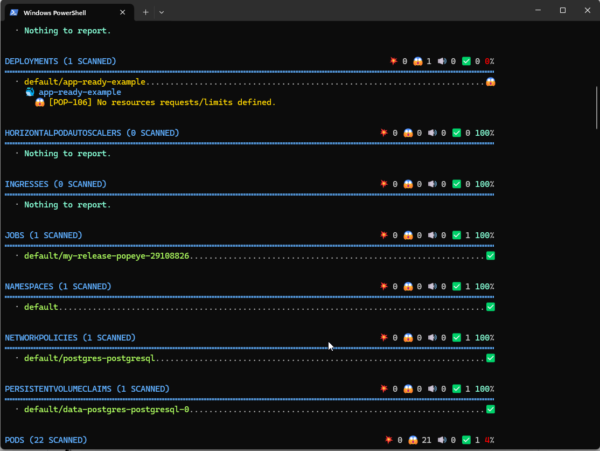

https://github.com/derailed/popeye

## Popeye: Kubernetes Live Cluster Linter

Popeye is a utility that scans live Kubernetes clusters and reports potential issues with deployed resources and configurations. As Kubernetes landscapes grows, it is becoming a challenge for a human to track the slew of manifests and policies that orchestrate a cluster. Popeye scans your cluster based on what's deployed and not what's sitting on disk. By linting your cluster, it detects misconfigurations, stale resources and assists you to ensure that best practices are in place, thus preventing future headaches. It aims at reducing the cognitive *over* load one faces when operating a Kubernetes cluster in the wild. Furthermore, if your cluster employs a metric-server, it reports potential resources over/under allocations and attempts to warn you should your cluster run out of capacity.

Popeye is a readonly tool, it does not alter any of your Kubernetes resources in any way!

## Deploy Helm in your Cluster 

helm repo add christianhuth https://charts.christianhuth.de
helm repo update
helm install my-release christianhuth/popeye

## Install Popeye API in your laptop

https://github.com/derailed/popeye/releases

